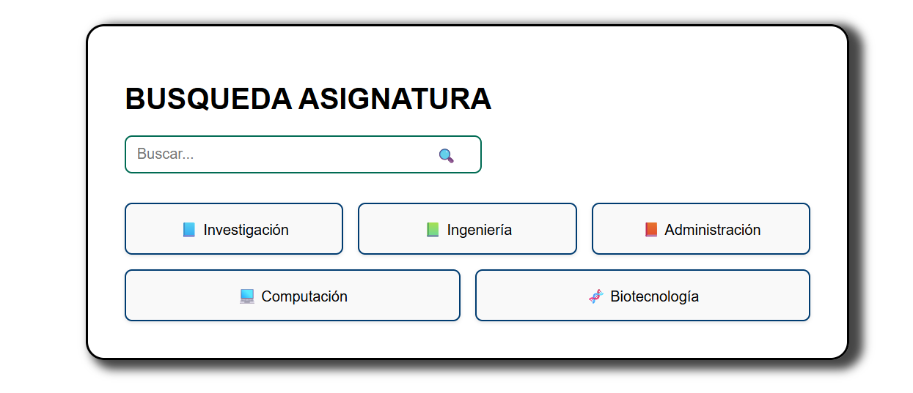
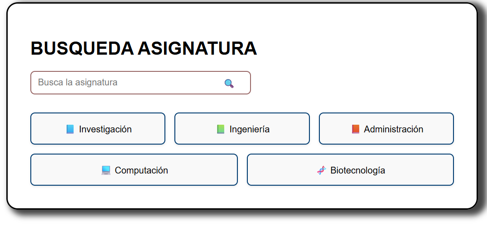
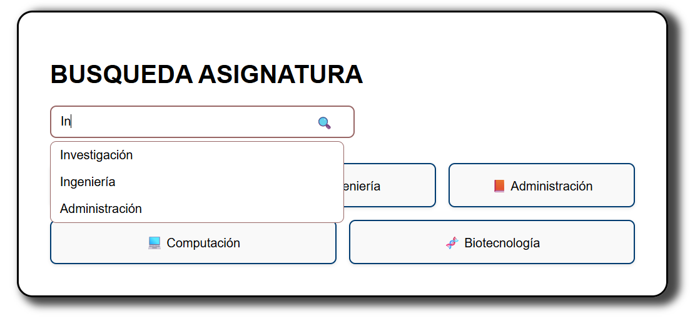
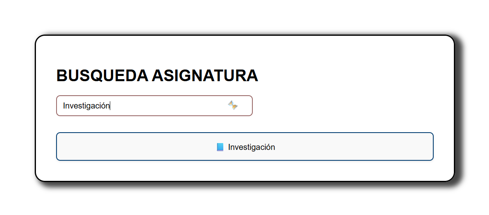

# 📘 <espe-search-input> – Componente Web

Componente Web reutilizable desarrollado con LitElement que permite realizar búsquedas con sugerencias en tiempo real, con personalización visual, accesibilidad, eventos personalizados e integración con identidad institucional de la **ESPE**.

Autor: Andrés Pantoja
---

## 🚀 Características

- 🔍 Input de búsqueda con sugerencias filtradas en vivo.
- 🎨 Personalización de tema (color del borde) y placeholder.
- ⏳ Estado `loading` con spinner.
- 🎯 Eventos personalizados para integración avanzada (`sugerencia-seleccionada`, `buscar-enter`).
- ✅ Accesibilidad (`aria-label`, `tabindex`, `role="search"`).
- 📱 Responsive, accesible y fácil de integrar.

---

## 🧩 Uso básico

```html
<espe-search-input></espe-search-input>
```

Por defecto:
- Color institucional `#003C71`.
- Placeholder: `Buscar...`.
- Ícono de lupa.
- Sin sugerencias iniciales.

---

## 🎛️ Atributos disponibles

| Atributo       | Tipo       | Descripción                                                       |
|----------------|------------|-------------------------------------------------------------------|
| `suggestions`  | `string[]` | Lista de sugerencias. Se pasa desde JavaScript.                  |
| `theme`        | `string`   | Color HEX para personalizar el borde del input.                  |
| `disabled`     | `boolean`  | Desactiva el input.                                              |
| `loading`      | `boolean`  | Muestra ícono de carga (spinner).                               |
| `placeholder`  | `string`   | Texto del placeholder (ayuda visual en el input).                |

---

## 📡 Eventos personalizados

| Evento                   | Descripción                                                                 |
|--------------------------|-----------------------------------------------------------------------------|
| `sugerencia-seleccionada` | Se emite al hacer clic en una sugerencia. Devuelve `{ value }`.             |
| `buscar-enter`            | Se emite al presionar **Enter**. Devuelve `{ value }`.                      |

### Ejemplo:

```js
const input = document.querySelector('espe-search-input');

input.suggestions = ['Investigación', 'Computación', 'Ingeniería'];

input.addEventListener('sugerencia-seleccionada', e => {
  console.log('Seleccionado:', e.detail.value);
});

input.addEventListener('buscar-enter', e => {
  console.log('Buscar:', e.detail.value);
});
```

---

## 🧪 Ejemplos visuales

Las siguientes imágenes muestran el componente en diferentes usos:

| Vista                              | Imagen                                 |
|------------------------------------|----------------------------------------|
| 🔹 Por defecto                     | `docs/1-default.png`                   |
| 🎨 Tema personalizado (`#006B53`) | `docs/2-theme-custom.png`              |
| ✏️ Placeholder modificado         | `docs/3-placeholder.png`               |
| 🧠 Con sugerencias                | `docs/4-suggestions.png`               |
| ✅ Resultado de búsqueda          | `docs/5-result.png`                    |


### Componente por defecto



### 2. Tema personalizado


### 3. Placeholder modificado


### 4. Uso con sugerencias


### 5. Resultado de búsqueda



---

## 📁 Estructura sugerida del repositorio

```
espe-search-input/
├── src/
│   └── espe-search-input.ts
├── index.html
├── README.md
└── docs/
    ├── 1-default.png
    ├── 2-theme-custom.png
    ├── 3-placeholder.png
    ├── 4-suggestions.png
    └── 5-result.png
```

---

## ✅ Recomendaciones

- Integra con el [ESPE UIKit](https://github.com/tu-url-espe-uikit) si aplica.
- Valida atributos como `theme` para asegurar que sea un color HEX válido.
- Usa `@property()` para exponer los atributos configurables.
